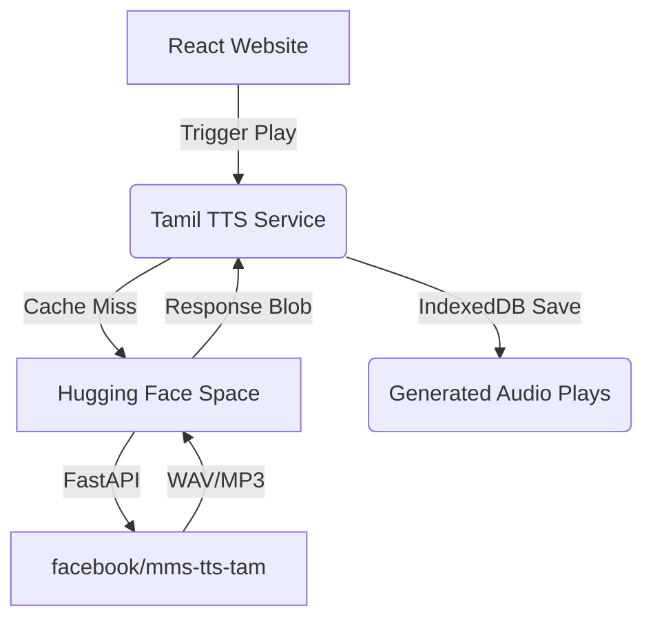

<div align="center">
  <h1>🌟 Kids Learning Platform 🌟</h1>
  <p><strong>A modern AI-powered multilingual educational platform for children</strong></p>
</div>

<br />

## 📖 About the Project

The Kids Learning Platform is an interactive, mobile-first web application designed to teach children alphabets, words, spelling, pronunciation, listening, and vocabulary through engaging mini-games.

The platform supports dynamic multi-language content (including offline support), document importing, Gamification (XP, Stars, Coins, Streak), and **native Tamil AI Text-to-Speech** via Hugging Face.

---

## ✨ Features

- ✅ **Multi-language support** (English, Tamil, Hindi, Telugu, Kannada, Malayalam)
- ✅ **Responsive UI** & **Mobile-first** architecture
- ✅ **Admin panel** for content management
- ✅ **DOCX import** for bulk vocabulary uploads
- 🚧 **PDF import** (Future Roadmap)
- ✅ **Tamil AI Text-to-Speech** (Zero-shot translation via Hugging Face Spaces)
- ✅ **Hugging Face integration** (`facebook/mms-tts-tam`)
- ✅ **IndexedDB audio caching** (Lightning-fast audio loading and offline resilience)
- ✅ **Browser fallback** for TTS
- ✅ **Offline support** (Progress and cached data works without internet)
- ✅ **Gamification** (Levels, Coins, Stars, Certificates)
- ✅ **Flashcards** & **Matching Games**
- ✅ **Letter arrangement** & **Missing letter** exercises
- ✅ **Interactive Quizzes**
- ✅ **Listening activity**
- ✅ **Progress tracking**
- ✅ **Accessibility** (Screen-reader friendly `aria-labels`)
- ✅ **PWA support** (Installable app)

---

## 📸 Screenshots

| Home Page | Word Explorer |
| :---: | :---: |
|  |  |

| Quiz Dashboard | Admin Panel |
| :---: | :---: |
|  |  |

*(Note: Add screenshot files to `assets/screenshots/`)*

---

## 🏗️ Architecture



---

## 💻 Technology Stack

### **Frontend**
- **Framework:** React 19 + TypeScript + Vite
- **Styling:** TailwindCSS
- **State Management:** Zustand (with persist middleware)
- **Routing:** React Router v7

### **Backend (Microservice)**
- **Framework:** FastAPI (Python)
- **Machine Learning:** Transformers, PyTorch
- **Model:** `facebook/mms-tts-tam`
- **Hosting:** Hugging Face Spaces

### **Storage & Caching**
- **Audio Cache:** IndexedDB (`idb`)
- **State Persistence:** Local Storage

---

## 🚀 Installation & Setup

### Local Development

1. **Install dependencies:**
   ```bash
   npm install
   ```

2. **Run the local development server:**
   ```bash
   npm run dev
   ```

### Production Build

Create an optimized production build:
```bash
npm run build
```

---

## 🌍 Deployment

- **Frontend:** Deploys easily to [Vercel](https://vercel.com/) (using `vercel.json` for SPA routing).
- **Backend:** Deployed securely on [Hugging Face Spaces](https://huggingface.co/spaces).

---

## 📂 Folder Structure

```
.
├── src/
│   ├── components/      # Reusable React components (SpeechButton, Navigation, etc.)
│   ├── pages/           # Application views (Activities, Admin, LandingPage)
│   ├── services/        # External integrations (IndexedDB, Tamil TTS, Gemini TTS)
│   ├── hooks/           # Zustand store and custom React hooks
│   └── types/           # TypeScript interfaces
├── public/              # Static assets, default language configurations (JSON)
├── tests/               # Playwright E2E testing scripts
└── Tamil-TTS-API/       # FastAPI Backend for Tamil Voice Generation
```

---

## 🗺️ Roadmap & Future Improvements

- [ ] Add generic PDF text extraction to the import tool.
- [ ] Implement user accounts and cloud synchronization for cross-device progress tracking.
- [ ] Expand native deep-learning TTS support to Hindi and Telugu.

---

## 🤝 Contributing

Contributions are always welcome! If you have suggestions or improvements, please fork the repository, make your changes, and open a Pull Request.

---

## 📄 License

This project is licensed under the [MIT License](LICENSE).

---

## 👤 Author

**Santhosh**
- GitHub: [@Santhoshcoder001](https://github.com/Santhoshcoder001)

## 🙏 Acknowledgements

- DeepMind / Google for AI assistance toolsets.
- Hugging Face for democratizing machine learning models.
- Meta / Facebook for the `mms-tts-tam` language model.
